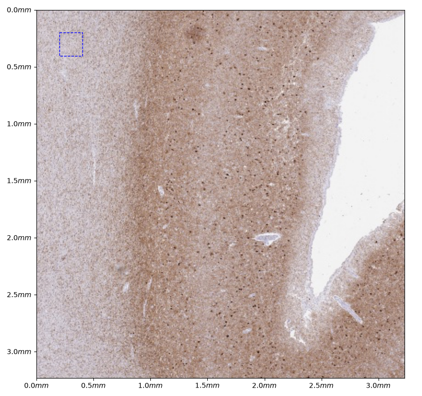
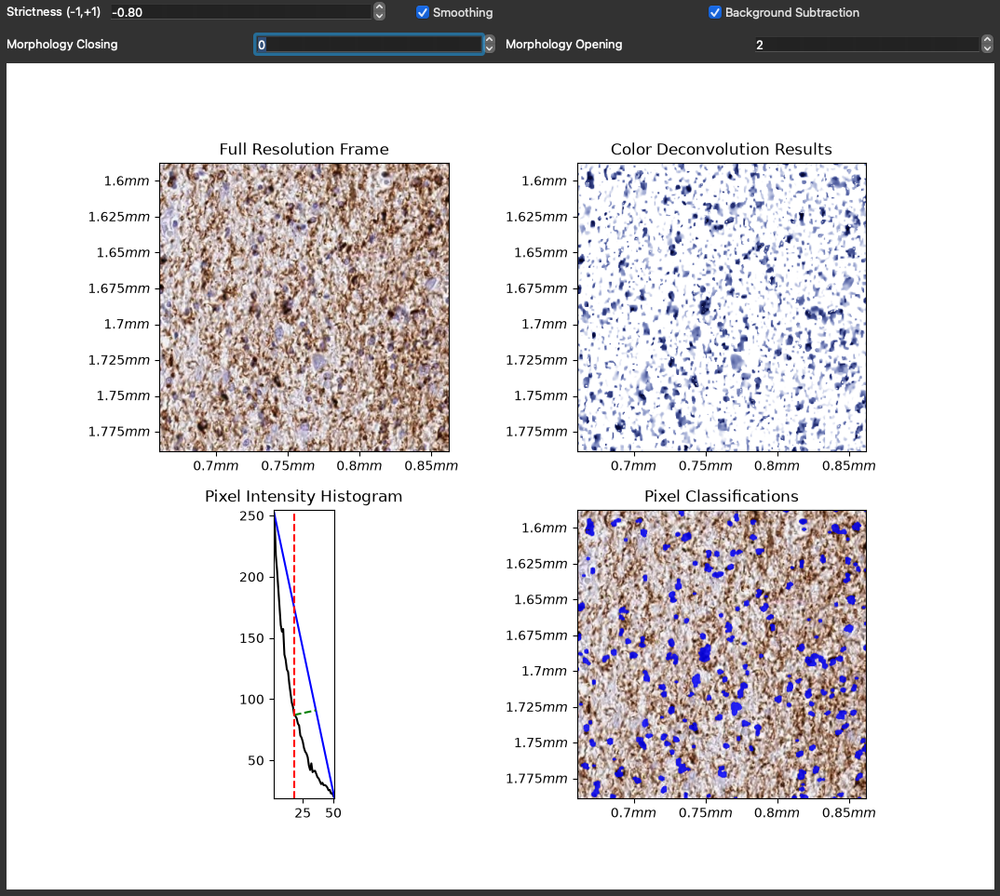
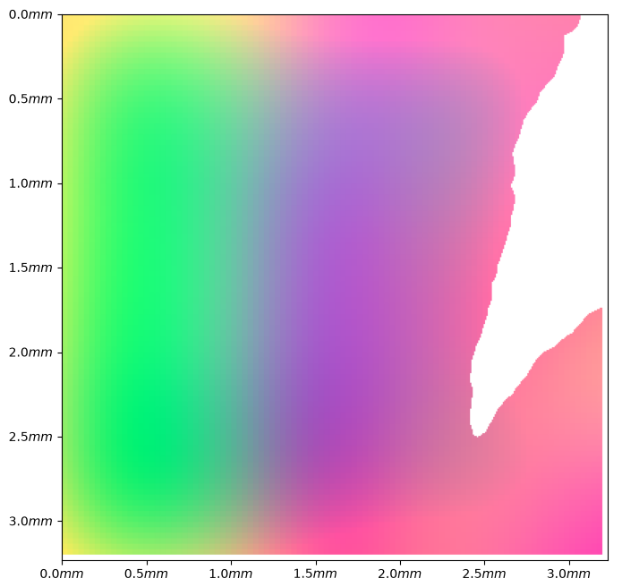
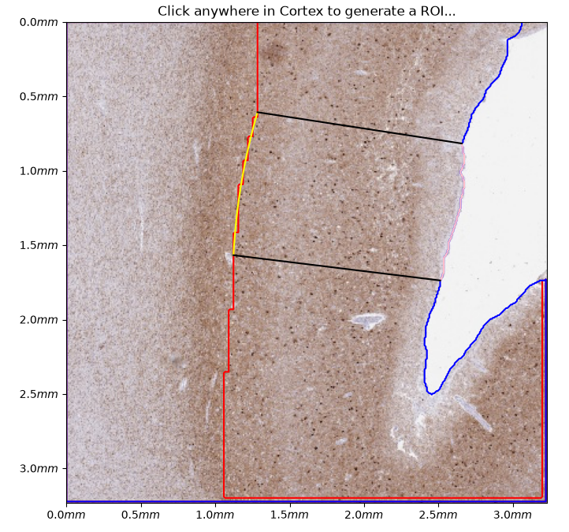
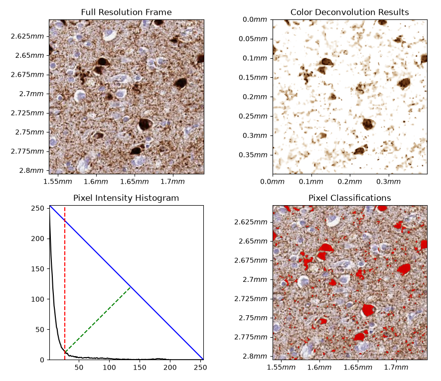
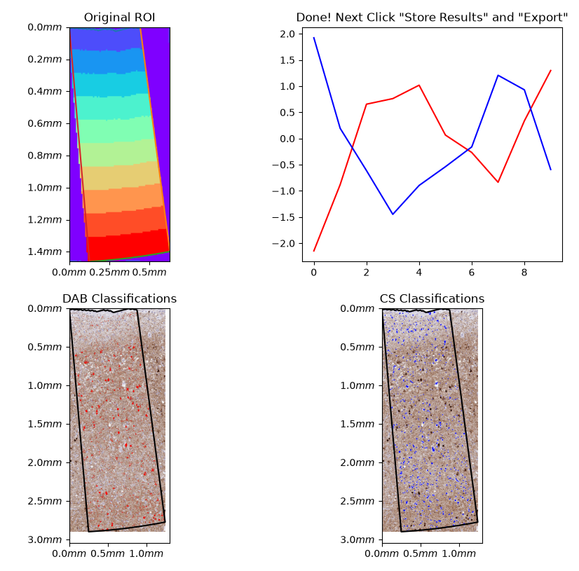

# Penn Digital Neuropathology Lab's (PDNL) Visualization Tools

This project is an ongoing development of visualization tools used for digital IHC analysis. 

## Requirements

Python3.12 or newer: https://github.com/PackeTsar/Install-Python$0


## Demo Installation (Command Line)

Create a virtual environment

Mac/Linux
```bash
python3 -m venv .pdnl_demo_venv
source .pdnl_demo_venv/bin/activate
```
Windows
```bash
python3 -m venv .pdnl_demo_venv
.pdnl_demo_venv\Scripts\activate
```
    
Install pdnl_viz using pip

```bash
python -m pip install pdnl_viz
```


## Usage

```bash
pdnl_demo
```

## Troubleshooting

#### Issues with numba, llvmlite, scikit-fmm

This often has to do with C++ compiler problems. 

On Mac, try this: https://stackoverflow.com/a/34617930

On Windows, try installing the base tools here: https://visualstudio.microsoft.com/visual-cpp-build-tools/$0

## Demo

##### Overview

This demo includes a series of visualizations which guide the user through the steps required to process a Whole Slide Image (WSI) file with the PDNL IHC suite of tools. The result of the demo also includes a set of parameters which can be used for processing a batch of WSI's. More information can be found in various other documentations or within tooltips in the application.


##### Counterstain Processing

We use the counterstain (in this image hematoxylin) in order to segment Gray Matter from White Matter in the WSI. We generally set the following parameters:
$Strictness=-0.8$, Hematoxylin is fairly specific, so we want to be lenient with thresholding.
$Smoothing=True$, Anisotropic Diffusion filtering smooths out the interiors of neuron and glia cells.
$Background Subtraction=True$, This normalizes the stain such that less background passes through the threshold
$Opening Radius=2 \mu m$, This cleans up some background noise


##### ROI Selection

This demo utilizes [NEUSEG](https://github.com/PennCompPathology/NEUSEG) to segment the cortex. The parameters in the previous step are applied to this process. The feature heatmap shows the change in cellular distributions across the brain tissue. The segmentation is drawn based on these changes.

Cell Feature Heatmap       |  Cortical Segmentations
:-------------------------:|:-------------------------:
  |  

##### Marker Processing

The next step is to set the processing parameters for the marker of interest. This highly depends on the characteristics of said marker, and should be determined for each marker individually. The available processing parameters are similar to the Counterstain Processing section.


##### ROI Quantification

Quantifying the ROI includes detecting the Positive Marker pixels and Positive Counterstain pixels, then measuring the amount of such pixels across the cortical mantle utilizing the shape of the ROI.


##### Next Steps

With an intuitive understanding of the available parameters and the characteristics of the marker of interest, a user can continue to the following tools for large scale analysis of WSI's.

1) [Segment WSI with NEUSEG](https://github.com/PennCompPathology/NEUSEG) 
2) [Extract images from WSI](https://github.com/PennCompPathology/pdnl_extract) 
3) [Process images using set parameters](https://github.com/PennCompPathology/pdnl_process)
4) [Generate quantitative results](https://github.com/PennCompPathology/pdnl_aggregate) 

## Roadmap

- Streamline command line tools into a single command for WSI quantification
- Extend GUI tools to allow batch quantification of a batch of WSI's
- Include PDNL machine learning models ([Tau Classification](https://github.com/PennCompPathology/pdnl_wildcat) & [Microglia Classification](https://github.com/PennCompPathology/pdnl_microglia))

## Support

For support, email noah.capp@pennmedicine.upenn.edu


